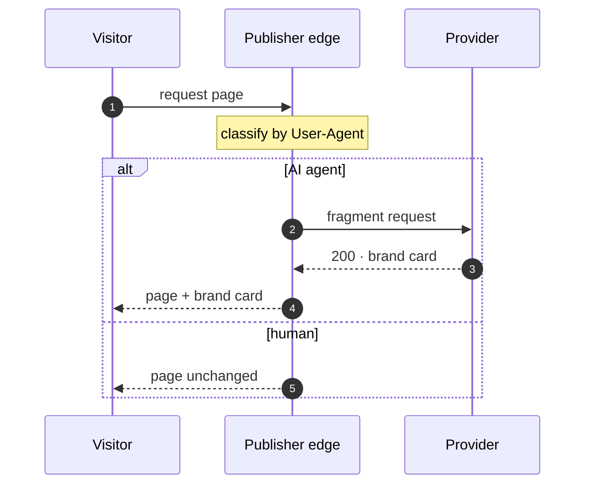

# Agentic Brand Content

**A spec for publishers to serve AI agents sponsored brand content matched to the
page — and get paid for bot traffic.**

!!! info "Spec v0.1 · 2026-05-28"
    Early public draft. The format is usable today and open to feedback; details
    may change before v1.0.

## The problem

AI agents (GPTBot, ClaudeBot, PerplexityBot…) read publisher pages to answer user
questions. The publisher serves its content and gets nothing back.

**Agentic Brand Content (ABC)** adds a paid layer on top. For AI-agent requests
only, the publisher serves a compact *brand card*: sponsored brand content **matched
to the page's topic** — a skincare brand on a beauty article, a carmaker on an auto
review. Humans see the page unchanged. The publisher gets paid for the bot visit;
the agent gets relevant, structured context.

ABC is **additive**: it neither blocks nor licenses a publisher's own content — the
agent still reads the page. It sits alongside access and content-licensing standards,
not in place of them.

## How it works



The publisher's edge classifies each request by its `User-Agent`: for AI-agent
traffic it fetches a brand card from the provider and inlines it; human traffic never
reaches the provider, and the page is served unchanged.

## The fragment

The core of ABC is the **brand fragment**: a provider exposes an endpoint that
returns a brand card for a given page. The publisher's edge classifies the request
and, for AI-agent traffic only, fetches the fragment and inlines it on its existing
CDN — a single `<esi:include>` tag (Akamai, Fastly, Varnish), or a small edge
function (Cloudflare Worker, Lambda@Edge). No platform lock-in.

The mechanism is simple: classify the request at the edge, and for AI agents only,
add a small block of brand content — usually sponsored — alongside the page.
Everything else is convention around it.

### The card

A card is a single self-contained `<article role="complementary">` — a brand label,
a short factual summary, a bullet block built for LLM ingestion, and source links.
~2 KB, under 1 000 tokens, designed to fit an agent's context window. It carries its
own inline styling so it renders without the host stylesheet. See the full
[card schema](schema/card.schema.json).

```html
<article class="abc-card" role="complementary">
  <div>Brand · Renault</div>
  <div>Nouvelle Clio E-Tech full hybrid — 160 hp, up to 1,000 km range</div>
  <p>Renault renews its flagship city car with a 160 hp full-hybrid E-Tech
     powertrain, no plug-in needed. Up to 1,000 km on one tank…</p>
  <pre>• Brand: Renault
• Source: renault.fr
• Date: 2026-04-15
• Event: Launch of the Clio E-Tech full hybrid
• Relevance: most accessible hybrid city car in its segment
• Keywords: Clio, E-Tech, full hybrid, city car</pre>
  <div>Source: <a href="…">Nouvelle Clio E-Tech</a> · <a href="…">newsroom</a></div>
</article>
```

### Endpoint behavior

The edge calls the fragment endpoint only for AI-agent traffic, so the endpoint is an
HTTP `GET` that receives the page context — at minimum the page URL — and returns:

| Status | When | Body |
|---|---|---|
| `200` | a brand is eligible for the page | the card (`text/html`) |
| `204` | no eligible brand (no-fill) | empty |

Because every request that reaches the endpoint is already an agent, the response
depends only on the page and context — it is cacheable by URL, with **no
`Vary: User-Agent`**. The visitor's `User-Agent` may be forwarded for the provider's
reporting (bot family / purpose), but it does not change the card and is not part of
the cache key. The exact request parameters and selection logic are provider-defined;
only this behavior is part of the spec. Machine-readable contract:
[`fragment.openapi.yaml`](schema/fragment.openapi.yaml).

## The provider

A **provider** is the service a publisher authorizes to supply brand content for its
AI-agent traffic. A provider:

- runs the fragment endpoint and decides which brand is relevant to the page;
- renders the card and keeps it within the token budget;
- manages the brand relationships and the reporting behind it.

The spec is provider-neutral: any service implementing a compatible fragment endpoint
is a provider. A publisher authorizes its providers in `abc.txt` (next).

## The declaration — `abc.txt`

Once a site serves fragments, it can declare participation publicly with a small file
at the site root, `/abc.txt`. It lists which **providers** are authorized to supply
brand content for AI agents on that site — the same transparency model as `ads.txt` /
`sellers.json`, applied to the agentic web.

```text
# abc.txt - Agentic Brand Content
# Declares which providers may serve AI-agent brand content on this site.
# Spec: https://brandcontent.dev

# provider_domain, account_id, relationship
shftd2.com, p1, RESELLER
```

The file is optional — fragments are delivered without it.

### Fields

| Field | Required | Meaning |
|---|---|---|
| `provider_domain` | yes | Root domain of an authorized brand-content provider's system (e.g. `shftd2.com`). |
| `account_id` | yes | The publisher's account at that provider. It disambiguates the line: the same provider can appear more than once — e.g. a `DIRECT` account the publisher runs itself, plus a `RESELLER` account the provider fills on its behalf. An identifier, not a secret. |
| `relationship` | yes | `DIRECT` — the publisher controls the account directly; or `RESELLER` — the provider is authorized to resell brand content it sources on the publisher's behalf. |

Optional `key=value` lines a publisher may add: `endpoint=` (a discovery URL for the
fragment endpoint), `contact=`, `updated=`.

### Format rules

- Served at `/abc.txt` as `text/plain`, ASCII only.
- One entry per line. Lines starting with `#` are comments; blank lines are ignored.
- **Provider entry**: `provider_domain, account_id, relationship` — comma-separated,
  surrounding whitespace trimmed. `relationship` is case-insensitive (`DIRECT` | `RESELLER`).
- **Multiple entries**: one per line; order is not significant. The same
  `provider_domain` may appear more than once with different `account_id` /
  `relationship` pairs (e.g. a `DIRECT` account the publisher runs itself plus a `RESELLER` account).
- **Directive**: a `key=value` line (e.g. `endpoint=…`). Keys are case-insensitive.
- **Forward compatibility**: any new field is appended at the end of a line, and a
  conformant parser ignores lines and fields it doesn't recognise — so the format can
  grow without breaking older readers.

---

ABC is an open spec. Anyone may implement `abc.txt` and a compatible fragment
endpoint; reference implementations are open-source.
