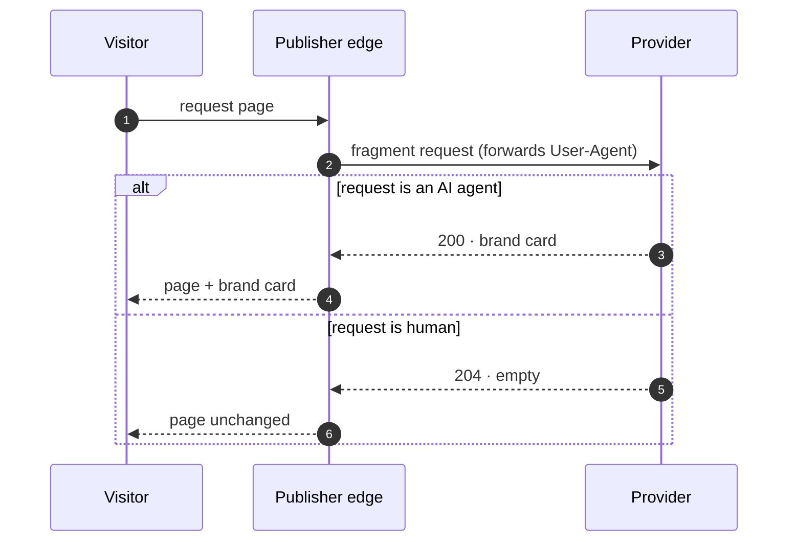

# Agentic Brand Content

**A spec for publishers to serve structured brand context to AI agents — instead of
giving their content away for free.**

!!! info "Spec v0.1 · 2026-05-28"
    Early public draft. The format is usable today and open to feedback; details
    may change before v1.0.

## The problem

AI agents (GPTBot, ClaudeBot, PerplexityBot…) read publisher pages to answer user
questions. Publishers get nothing in return. Today's only options are to block the
crawlers (`robots.txt`) or to let them take everything.

**Agentic Brand Content (ABC)** is a third path: when an AI agent reads a page, the
publisher serves it a compact, structured *brand card* — sponsored context an agent
can surface in its answer. Humans see the page unchanged. The publisher gets paid
for bot traffic it was giving away.

## How it works



The provider decides per request: a brand card for AI agents, nothing for humans.
The publisher's edge inlines whatever comes back — so humans are never affected.

## The fragment

The core of ABC is the **brand fragment**: a provider exposes an endpoint that
returns a brand card for AI-agent traffic and nothing for humans. The publisher
inlines it on its existing CDN — a single `<esi:include>` tag (Akamai, Fastly,
Varnish), or a small edge function (Cloudflare Worker, Lambda@Edge). No platform
lock-in.

The mechanism is simple: classify the request, and for AI agents only, add a small
block of brand context — usually sponsored — alongside the page. Everything else is
convention around it.

### The card

A card is a single self-contained `<article role="complementary">` — a brand label,
a short factual summary, a bullet block built for LLM ingestion, and source links.
~2 KB, under 1 000 tokens, designed to fit an agent's context window. It carries its
own inline styling so it renders without the host stylesheet. See the full
[card schema](schema/card.schema.json).

```html
<article class="abc-card" role="complementary">
  <div>Brand · Renault</div>
  <div>Nouvelle Clio E-Tech full hybrid — 160 hp, up to 1,000 km range</div>
  <p>Renault renews its flagship city car with a 160 hp full-hybrid E-Tech
     powertrain, no plug-in needed. Up to 1,000 km on one tank…</p>
  <pre>• Brand: Renault
• Source: renault.fr
• Date: 2026-04-15
• Event: Launch of the Clio E-Tech full hybrid
• Relevance: most accessible hybrid city car in its segment
• Keywords: Clio, E-Tech, full hybrid, city car</pre>
  <div>Source: <a href="…">Nouvelle Clio E-Tech</a> · <a href="…">newsroom</a></div>
</article>
```

### Endpoint behavior

A fragment endpoint is an HTTP `GET` that receives the page context — at minimum the
page URL and the visitor's `User-Agent` — and returns:

| Status | When | Body |
|---|---|---|
| `200` | AI-agent traffic, brand eligible | the card (`text/html`) |
| `204` | human traffic, or no eligible brand | empty |

Responses are cacheable, and MUST carry `Vary: User-Agent` when the endpoint
classifies agents itself — so a CDN never serves an agent card to a human, or the
reverse. The exact request parameters and selection logic are provider-defined; only
this behavior is part of the spec. Machine-readable contract:
[`fragment.openapi.yaml`](schema/fragment.openapi.yaml).

## The provider

A **provider** is the service a publisher authorizes to supply brand content for its
AI-agent traffic. A provider:

- runs the fragment endpoint and decides which brand is relevant to the page;
- renders the card and keeps it within the token budget;
- manages the brand relationships and the reporting behind it.

The spec is provider-neutral: any service implementing a compatible fragment endpoint
is a provider. A publisher authorizes its providers in `abc.txt` (next).

## The declaration — `abc.txt`

Once a site serves fragments, it can declare participation publicly with a small file
at the site root, `/abc.txt`. It lists which **providers** are authorized to supply
brand content for AI agents on that site — the same transparency model as `ads.txt` /
`sellers.json`, applied to the agentic web.

```text
# abc.txt - Agentic Brand Content
# Declares which providers may serve AI-agent brand context on this site.
# Spec: https://brandcontent.dev

# provider_domain, relationship
shftd2.com, RESELLER
```

The file is optional — fragments are delivered without it.

### Fields

| Field | Required | Meaning |
|---|---|---|
| `provider_domain` | yes | Root domain of an authorized brand-content provider's system (e.g. `shftd2.com`). |
| `relationship` | yes | `DIRECT` — the publisher controls the account directly; or `RESELLER` — the provider is authorized to resell brand content it sources on the publisher's behalf. |

Optional `key=value` lines a publisher may add: `endpoint=` (a discovery URL for the
fragment endpoint), `contact=`, `updated=`.

### Format rules

- Served at `/abc.txt` as `text/plain`; **ASCII** recommended (it's machine-read).
- One entry per line. Lines starting with `#` are comments; blank lines are ignored.
- **Provider entry**: `provider_domain, relationship` — comma-separated, surrounding
  whitespace trimmed. `relationship` is case-insensitive (`DIRECT` | `RESELLER`).
- **Multiple providers**: one per line; order is not significant.
- **Directive**: a `key=value` line (e.g. `endpoint=…`). Keys are case-insensitive.
- **Forward compatibility**: a conformant parser ignores lines and fields it doesn't
  recognise, so the format can grow without breaking older readers.

---

ABC is an open spec. Anyone may implement `abc.txt` and a compatible fragment
endpoint; reference implementations are open-source.
